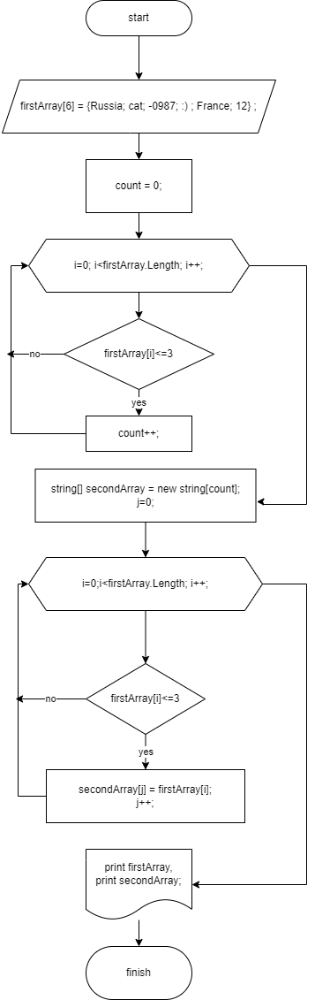

**План решения контрольной работы**

1. Создать локальный репозиторий
2. Создать блок-схему решения задачи.
3. Поместить блок-схему в текущий репозиторий. (*сделать коммит*)
4. Описать решение задачи. (*сделать коммит*)
5. Написать код, решающий поставленную задачу. (*сделать коммит*)
6. Создать удаленный репозиторий на GItHub.
7. Сделать push локального репозитория в удаленный.

**Ниже прикрепляю схему решения задачи:**

